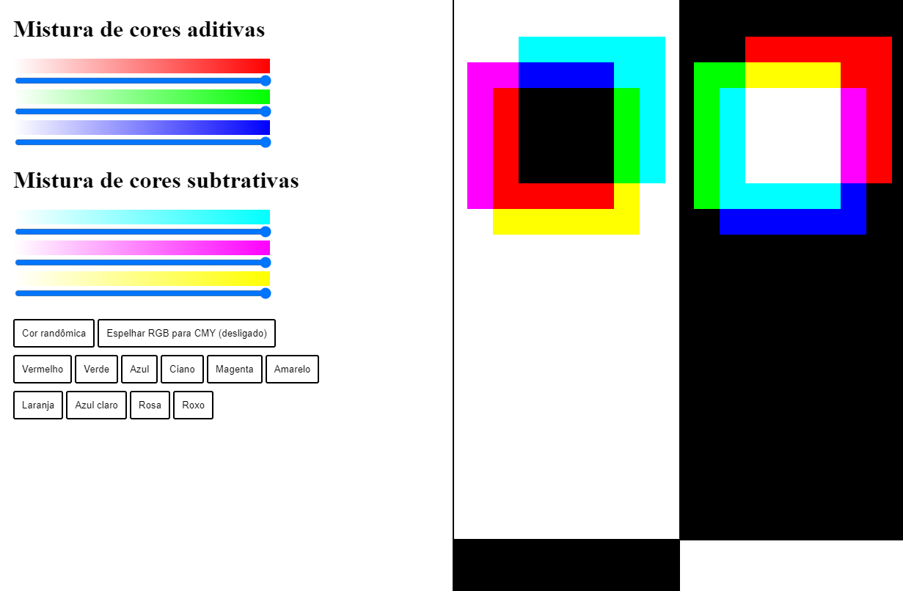

## <strong>colors_manipulation_CG</strong>
Implementação de um trabalho de Computação Gráfica com o manipulamento de cores nos esquemas RGB e CMY com a utilização do HTML, CSS e Javascript.

# <strong>Execução</strong>

Basta fazer o download do projeto e executar o arquivo "index.html" para conseguir a utilização deste projeto.
